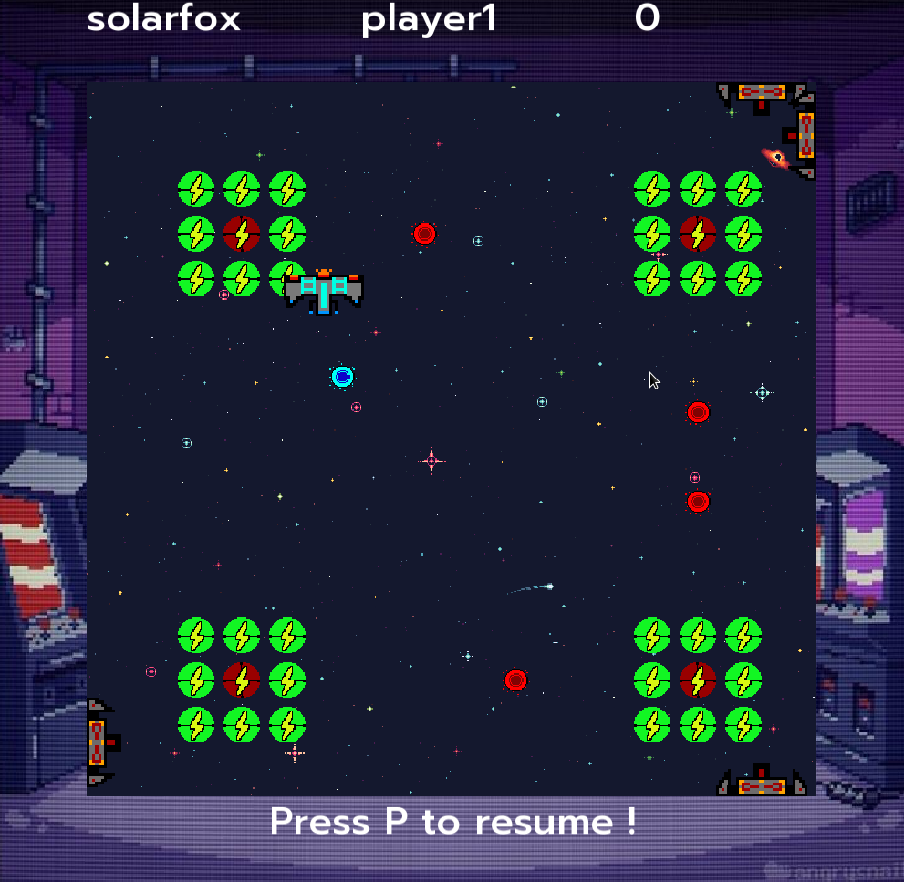

****
SolarFox
****

Description
===========
The SolarFox game is a game where you are a spaceship trying to collect the 
most energy possible (bonuses) in space while trying to survive the enemy attacks.

Game rules
===========
The goal of the game is to have the highest score.
You need to shoot the bonuses to gain points (+5), but be cautios to not shoot on the maluses or else you will lose. 
Of course being shot by one of the enemy missiles makes you lose, and touching the borders too. 

Commands
===========

Movements:
    - Arrow keys -> Left, Right, Up and Down
    - S Key -> Speed Boost
Attack:
    - Spacebar -> Launch missile

Else:
    - D Key -> Slow down ennemy missiles and frequency
    - P Key -> Pause the game
    - R Key -> Restart the game
    - N Key -> Switch to next Game
    - B Key -> Switch to previous Game
    - L Key -> Switch to next display lib
    - K Key -> Switch to previous display lib
    - Esc Key -> Go back to menu